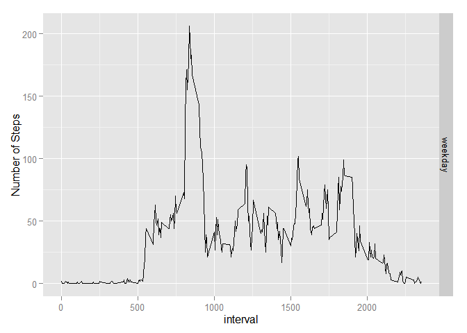

# Reproducible Research: Peer Assessment 1


## Loading and preprocessing the data


```r
#Load data (i.e. read.csv())

activity <- read.csv("activity.csv")

#Change class for the date variable

activity$date <- as.Date(activity$date)
```

## What is mean total number of steps taken per day?


```r
#Histogram of daily steps

library(ggplot2)
```

```
## Warning: package 'ggplot2' was built under R version 3.1.3
```

```r
steps.date <- aggregate(steps ~ date, data = activity, FUN = sum ,na.rm=TRUE)

names(steps.date) <- c("date","steps")

histogram1 <- ggplot(steps.date,aes(x = steps))+
  ggtitle("Histogram of daily steps") +
  xlab("Steps (binwidth 2000)") +
  geom_histogram(binwidth = 2000)


histogram1
```

 

```r
#mean of total number of steps per day

mean(steps.date$steps, na.rm = TRUE)
```

```
## [1] 10766.19
```

```r
#median of total number of steps  per day

median(steps.date$steps, na.rm = TRUE)
```

```
## [1] 10765
```

## What is the average daily activity pattern?


```r
#aggregate steps per interval, calculating the mean across days


steps.interval <- aggregate(steps ~ interval, data = activity, FUN = mean ,na.rm=TRUE)

names(steps.interval) <- c("interval","steps")

time.series.plot <- plot(steps.interval, type = "l", main = "Time series plot type = l " )
```

 

```r
time.series.plot
```

```
## NULL
```

```r
#5-mins interval with maximum number of steps

steps.interval$interval[which.max(steps.interval$steps)]
```

```
## [1] 835
```

## Imputing missing values


```r
#total number of missing values

sum(is.na(activity))
```

```
## [1] 2304
```

```r
#replace the NA's with the median number of steps for that period


activity <- merge(activity, steps.interval, by = "interval", suffixes = c("", 
    ".y"))

nas.steps <- is.na(activity$steps)

activity$steps[nas.steps] <- activity$steps.y[nas.steps]

activity <- activity[, c(1:3)]


#sumnumber of steps by day 

steps.date <- aggregate(steps ~ date, data = activity, FUN = sum, na.rm=TRUE)

names(steps.date) <- c("Date", "steps")

histogram2 <- qplot(steps, data = steps.date, geom="histogram", xlab = "Daily number of steps", binwidth = 300)

histogram2
```

 

```r
#mean of total number of steps by day

mean(steps.date$steps , na.rm = TRUE)
```

```
## [1] 10766.19
```

```r
#median of total number of steps by day

median(steps.date$steps , na.rm = TRUE)
```

```
## [1] 10766.19
```

## Are there differences in activity patterns between weekdays and weekends?


```r
#add the Weekday/weekend identifier

activity$week <- ifelse(weekdays(activity$date) == "Saturday" | weekdays(activity$date) == "Sunday" ,"weekend","weekday")

#the mean and median number of steps taken, averaged across all days (y-axis)

intsteps2 <- aggregate(activity$steps, by = list(activity$week, activity$interval), mean, na.rm=TRUE)
intstepsmed2 <- aggregate(activity$steps, by = list(activity$week, activity$interval), median, na.rm=TRUE)

intsteps2 <- cbind(intsteps2[], intstepsmed2$x)

#tidy names and round the numbers
names(intsteps2) = c("weekday", "interval","mean.steps", "median.steps")
intsteps2$mean.steps <- round(intsteps2$mean.steps)
intsteps2$median.steps <- round(intsteps2$median.steps)


ggplot(intsteps2, aes(x = interval, y = mean.steps)) + ylab("Number of Steps") + geom_line() + facet_grid(weekday~.)
```

 
